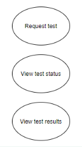
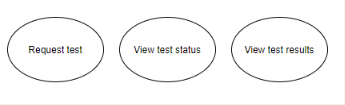
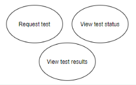
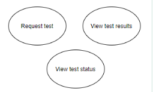

# Object Oriented Analysis & Design

## Introduction to OOAD and UML

### Q1. Which of the following statements about OOAD is correct?

1. Principles of OOAD are used once the software is developed.
2. Principles of OOAD are used before you start developing the software.
3. Principles of OOAD are used in the middle of software development.
4. Principles of OOAD are used once the software has been developed and launched in the market.

> ✓ Correct Answer-> **2**
>
> Feedback:
> _OOAD is used to define what functionalities the system needs to perform and how those functionalities will be implemented. As OOAD provides requirements and implementations for the system, it is the first step in any software development. This is the correct option._

### Q2. Which of the following statements is correct regarding attributes and methods?

1. Both attributes and methods define the properties of an object.
2. Attributes define the properties of an object, while methods define the actions of an object.
3. Both attributes and methods define the actions of an object.
4. Attributes define the actions of an object, while methods define the properties of an object.

> ✓ Correct Answer -> **2**
>
> Feedback :
> _Attributes define the properties of an object, while methods define the actions of an object. This option is correct._

### Q3. Which of the following statements is correct regarding UML (Unified Modeling Language)?

1. UML is a procedural programming language.
2. UML is an object-oriented programming language.
3. UML is not a programming language.
4. UML is a mix of procedural programming language and object-oriented programming language.

> ✓ Correct Answer -> **3**
>
> Feedback:
> _UML is used to design a system using visual representations and diagrams. It is not a programming language. This option is correct._

## Use Case Diagram

### Q1. Why will there be a communication gap between the Product Manager and the Developer if the software requirements are given in the form of textual information?

1. All the requirements cannot be captured in the textual form.
2. Plain text can be misinterpreted by some developers.

> ✕ Incorrect Answer -> **1**
>
> Feedback:
> _You can write elaborate textual documents to capture and explain all the requirements. So, this option is incorrect._

> ✓ Correct Answer -> **2**
>
> Feedback:
> _With plain text, you can write down all the requirements. But plain texts are open to interpretation, which can sometimes lead to misinterpretation. This is the reason why programming is not done in plain English text._

### Q2. Which of the following functionalities cannot be performed by the supplier? (Note: More than one option may be correct.)

1. Placing an order for other suppliers

2. Cancelling a placed order

3. Viewing an order

4. Updating an order

> ✓ Correct Answer -> **1**
>
> Feedback:
> _A supplier should not be able to place an order for other suppliers using the Inventory Management System. If the supplier himself is managing a separate inventory, then he will have a separate Inventory Management System for himself and he will be the Admin for that system. This is not the functionality performed by the supplier. Hence, this is one of the correct choices._

> ✓ Correct Answer -> **2**
>
> Feedback:
> _If a supplier does not have the requested products and has no time to manufacture the same, he will not accept the order. But he cannot cancel a placed order, as the same order can be supplied by some other supplier. This is not the functionality performed by the supplier; it should be performed by the Inventory Manager or Admin. Hence, this is one of the correct choices._

> ✓ Correct Answer -> **4**
>
> Feedback:
> _If a supplier does not have all the requested products and has no time to manufacture the same, he can refuse to supply the order. But he cannot update the placed order according to his convenience. This is not the functionality performed by the supplier; it should be performed by the Inventory Manager. Hence, this is one of the correct choices._

### Q3. Mark all the statements that are true in the context of use case diagrams. (Note: More than one option may be correct.)

1. Use case diagrams show what functionalities the system will perform.
2. Use case diagrams can only be drawn once you have the requirements in a textual form.
3. You don’t need any knowledge of programming to draw use case diagrams.

> ✓ Correct Answer -> **1**
>
> Feedback:
> _Use case diagrams are drawn during the findings of the analysis phase of OOAD and are used to capture the requirements for the system. So, they show what functionalities the system will perform. Hence, this is one of the correct options._

> ✕ Incorrect Answer -> **2**
>
> Feedback:
> _Use case diagrams can also be drawn without having the requirements in a textual form. In this approach, instead of writing requirements and actors in plain text, you just draw them. So, this option is incorrect._

> ✓ Correct Answer -> **3**
>
> Feedback:
> _Use case diagrams only represent what functionality the system will perform in simple English. So, you don’t need any programming knowledge. Hence, this is one of the correct options._

### Q4. In the UPSTAC application, the users can request a medical test. They then wait for the test request to be approved by the authorities. After approval and testing, they should be able to view the results in the app. Which of the following options correctly represents the use cases of the aforementioned system? [Note: Multiple options may be correct]

1. 
2. 
3. 
4. 

> ✓ Correct Answer -> **1**
>
> Feedback:
> _Use cases can be in any order and orientation. Here, you are capturing all the use cases from the requirement. So, this option is one of the correct choices._

> ✓ Correct Answer -> **2**
>
> Feedback:
> _Use cases can be in any order and orientation. Here, you are capturing all the use cases from the requirement. So, this option is one of the correct choices._

> ✓ Correct Answer -> **3**
>
> Feedback:
> _Use cases can be in any order and orientation. Here, you are capturing all the use cases from the requirement. So, this option is one of the correct choices._

> ✓ Correct Answer -> **4**
> Feedback:
> _Use cases can be in any order and orientation. Here, you are capturing all the use cases from the requirement. So, this option is one of the correct choices._
