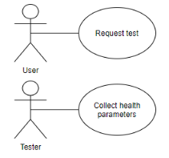

# Object Oriented Analysis & Design

## Introduction to OOAD and UML

### Q1. Which of the following statements about OOAD is correct?

1. Principles of OOAD are used once the software is developed.
2. Principles of OOAD are used before you start developing the software.
3. Principles of OOAD are used in the middle of software development.
4. Principles of OOAD are used once the software has been developed and launched in the market.

> ✓ Correct Answer-> **2**
>
> Feedback:
> _OOAD is used to define what functionalities the system needs to perform and how those functionalities will be implemented. As OOAD provides requirements and implementations for the system, it is the first step in any software development. This is the correct option._

### Q2. Which of the following statements is correct regarding attributes and methods?

1. Both attributes and methods define the properties of an object.
2. Attributes define the properties of an object, while methods define the actions of an object.
3. Both attributes and methods define the actions of an object.
4. Attributes define the actions of an object, while methods define the properties of an object.

> ✓ Correct Answer -> **2**
>
> Feedback :
> _Attributes define the properties of an object, while methods define the actions of an object. This option is correct._

### Q3. Which of the following statements is correct regarding UML (Unified Modeling Language)?

1. UML is a procedural programming language.
2. UML is an object-oriented programming language.
3. UML is not a programming language.
4. UML is a mix of procedural programming language and object-oriented programming language.

> ✓ Correct Answer -> **3**
>
> Feedback:
> _UML is used to design a system using visual representations and diagrams. It is not a programming language. This option is correct._

## Use Case Diagram

### Q1. Why will there be a communication gap between the Product Manager and the Developer if the software requirements are given in the form of textual information?

1. All the requirements cannot be captured in the textual form.
2. Plain text can be misinterpreted by some developers.

> ✕ Incorrect Answer -> **1**
>
> Feedback:
> _You can write elaborate textual documents to capture and explain all the requirements. So, this option is incorrect._

> ✓ Correct Answer -> **2**
>
> Feedback:
> _With plain text, you can write down all the requirements. But plain texts are open to interpretation, which can sometimes lead to misinterpretation. This is the reason why programming is not done in plain English text._

### Q2. Which of the following functionalities cannot be performed by the supplier? (Note: More than one option may be correct.)

1. Placing an order for other suppliers

2. Cancelling a placed order

3. Viewing an order

4. Updating an order

> ✓ Correct Answer -> **1**
>
> Feedback:
> _A supplier should not be able to place an order for other suppliers using the Inventory Management System. If the supplier himself is managing a separate inventory, then he will have a separate Inventory Management System for himself and he will be the Admin for that system. This is not the functionality performed by the supplier. Hence, this is one of the correct choices._

> ✓ Correct Answer -> **2**
>
> Feedback:
> _If a supplier does not have the requested products and has no time to manufacture the same, he will not accept the order. But he cannot cancel a placed order, as the same order can be supplied by some other supplier. This is not the functionality performed by the supplier; it should be performed by the Inventory Manager or Admin. Hence, this is one of the correct choices._

> ✓ Correct Answer -> **4**
>
> Feedback:
> _If a supplier does not have all the requested products and has no time to manufacture the same, he can refuse to supply the order. But he cannot update the placed order according to his convenience. This is not the functionality performed by the supplier; it should be performed by the Inventory Manager. Hence, this is one of the correct choices._

### Q3. Mark all the statements that are true in the context of use case diagrams. (Note: More than one option may be correct.)

1. Use case diagrams show what functionalities the system will perform.
2. Use case diagrams can only be drawn once you have the requirements in a textual form.
3. You don’t need any knowledge of programming to draw use case diagrams.

> ✓ Correct Answer -> **1**
>
> Feedback:
> _Use case diagrams are drawn during the findings of the analysis phase of OOAD and are used to capture the requirements for the system. So, they show what functionalities the system will perform. Hence, this is one of the correct options._

> ✕ Incorrect Answer -> **2**
>
> Feedback:
> _Use case diagrams can also be drawn without having the requirements in a textual form. In this approach, instead of writing requirements and actors in plain text, you just draw them. So, this option is incorrect._

> ✓ Correct Answer -> **3**
>
> Feedback:
> _Use case diagrams only represent what functionality the system will perform in simple English. So, you don’t need any programming knowledge. Hence, this is one of the correct options._

### Q4. In the UPSTAC application, the users can request a medical test. They then wait for the test request to be approved by the authorities. After approval and testing, they should be able to view the results in the app. Which of the following options correctly represents the use cases of the aforementioned system? [Note: Multiple options may be correct]

1. 
2. 
3. 
4. 

> ✓ Correct Answer -> **1**
>
> Feedback:
> _Use cases can be in any order and orientation. Here, you are capturing all the use cases from the requirement. So, this option is one of the correct choices._

> ✓ Correct Answer -> **2**
>
> Feedback:
> _Use cases can be in any order and orientation. Here, you are capturing all the use cases from the requirement. So, this option is one of the correct choices._

> ✓ Correct Answer -> **3**
>
> Feedback:
> _Use cases can be in any order and orientation. Here, you are capturing all the use cases from the requirement. So, this option is one of the correct choices._

> ✓ Correct Answer -> **4**
> Feedback:
> _Use cases can be in any order and orientation. Here, you are capturing all the use cases from the requirement. So, this option is one of the correct choices._

### Q5. In the UPSTAC application, users can request a test. The tester is supposed to collect the health parameters. The doctor looks at the collected health parameters, diagnoses the patient, and updates the test results. Which of the following options correctly represents all use cases and actors for the aforementioned system?

1. 
2. 
3. 
4. 

> ✓ Correct Answer -> **4**
>
> Feedback:
> _Here, you are capturing all the use cases and actors that were part of the requirements given in the problem description. Also, the use cases and actors are represented using correct figures. So, this option is the correct choice._

### Q6. In the UPSTAC application, the user requests for the test, and the tester collects the health parameters. Which of the following is the correct use case diagram for the given two actors and use cases? [Note: More than one option may be correct]

1. 
2. 
3. 
4. 

> ✓ Correct Answer -> **1**
>
> Feedback:
> _Both the actors and use cases are represented appropriately. The order or the position of the use cases and actors does not matter if they are connected correctly. So, this option is correct._

> ✓ Correct Answer -> **3**
>
> Feedback:
> _Both the actors and use cases are represented appropriately. The order or the position of the use cases and actors does not matter if they are connected correctly. So, this option is correct._

### Q7. In the UPSTAC application, a user requests for tests, and the tester collects the health parameters. These are then given to the doctor, who updates the test results, which can later be viewed by the user. Which of the following is the correct use case diagram for the aforementioned system?

1. 
2. 
3. 
4. 

> ✓ Correct Answer -> **4**
>
> Feedback:
> _All the use cases are correct functionalities and are appropriately matched with the respective actors. This option is correct._

### Q8. In UPSTAC, a test management system is created where the users can request for tests. On approval, they can get tested and subsequently view the results. Which of the following is the correct use case diagram for the aforementioned system?

1. 
2. 

> ✓ Correct Answer -> **2**
>
> Feedback:
> _Viewing and updating test results must be two separate tasks. This option is incorrect._

### Q9. In the UPSTAC application, one of the responsibilities of the concerned government authorities is to verify the roles of doctors and testers in the app. The doctors and testers are given corresponding certificates for their roles, which they must upload in order to get approved. Take a look at the following diagram depicting the aforementioned system and mark all the statements that are correct. [Note: More than one option may be correct.]

1. To approve user using the Verify certificate use case, the concerned government authorities have to first view the certificate using the View certificate use case.

2. To approve a user using the Verify certificate use case, the concerned government authorities can first view the certificate using the View certificate use case, but it is not mandatory.

3. To execute the View certificate use case, the Verify certificate use case needs to be executed first, but the reverse is not true.

4. To execute the Verify certificate use case, the View certificate use case needs to be executed first, but the reverse is not true.

> ✓ Correct Answer -> **1**
>
> Feedback:
> _The included use case has to be executed before the including use case can execute. In this case, Verify certificate is the including use case, whereas View certificate is the included use case. So, whenever the authorities verify a certificate using the Verify certificate use case, they have to first view the certificate using the View certificate use case. This option is one of the correct choices._

> ✓ Correct Answer -> **4**
>
> Feedback:
> _The included use case has to be executed before the including use case. In this case, Verify certificate is the including use case, whereas View Invoice is the included use case. So, to execute the Verify certificate use case, the View Invoice use case needs to be executed first, not the other way around. This is one of the correct choices._

### Q10. In UPSTAC, one of the responsibilities of the concerned government authorities is to verify the roles of doctors and testers in the app. The doctors and testers are given corresponding certificates for their roles, which they must upload in order to get approved. Take a look at the following diagrams about include relationships and mark all of the correct options.

1. 
2. 
3. 

> ✓ Correct Answer -> **2**
>
> Feedback:
> _In this option, there is no connection between the Upload certificate and the View certificate use cases, which is correct, as these two use cases are independent of each other. A doctor can view the certificate whenever needed, without having to upload the certificate every time. Also, a Verify certificate use case is dependent on the View certificate use case, which is also correctly represented here. This option is correct._

### Q11. Take a look at the following diagram and mark the correct statement.

1. Whenever the authorities want to view the statistics using the View statistics use case, they must first view the test results of patients in a locality using the View test results by pin-code use case.
2. Whenever the authorities want to view the statistics using the View statistics use case, they can first view the test results of patients in a locality using the View test results by pin-code use case. However, this is not mandatory.
3. To execute the View statistics use case, the View test results by pin-code use case needs to be executed first, but the reverse is not true.
4. To execute the View test results by pin-code use case, the View statistics use case needs to be executed first, but the reverse is not true.

> ✓ Correct Answer -> **2**
>
> Feedback:
> _The extended use case (to which the arrow points) can be executed with or without the execution of the extending use case (from which the arrow starts). In this case, View statistics is an extended use case, whereas View test results by pin-code use case is an extending use case. So, whenever the concerned government authorities want to view the statistics using the View Statistics use case, they have the option to first check the test results using the View test results by pin-code use case. However, viewing test results by PIN code is not mandatory. This option is correct._

### Q. Which of the following statements regarding include and extend relationships is correct?

1. In an include relationship, the arrow starts from the including use case and points towards the included use case, whereas in an extend relationship, the arrow starts from the extended use case and points towards the extending use case.

2. In an include relationship, the arrow starts from the included use case and points towards the including use case, whereas in an extend relationship, the arrow starts from the extending use case and points towards the extended use case.

3. In an include relationship, the arrow starts from the including use case and points towards the included use case. Similarly, in an extend relationship, the arrow starts from the extending use case and points towards the extended use case.

4. In an include relationship, the arrow starts from the included use case and points towards the including use case. Similarly, in an extend relationship, the arrow starts from the extended use case and points towards the extending use case.

> ✕ Incorrect Answer -> **1**
>
> Feedback:
> _In both include and extend relationships, the arrow starts from the ‘ing’ use case and points towards the ‘ed’ use case, i.e., from including to included and from extending to extended. This option is not the correct choice._

> ✓ Correct Answer -> **3**
>
> Feedback:
> _In both include and extend relationships, the arrow starts from the ‘ing’ use case and points towards the ‘ed’ use case, i.e., from including to included and from extending to extended. This option is the correct choice._

## Activity Diagram

### Q1. In UPSTAC, the doctor can login and upload the medical test results. The users can then view the test results. Which is the correct activity diagram for the aforementioned system?

1. 
2. 

> ✓ Correct Answer -> **1**
>
> Feedback:
> _The initial node is represented as a solid dot, and the activity final node is represented as a solid dot inside a circle. The activity starts at the initial node, with the arrow pointing away from the initial node. Similarly, the activity ends at the activity final node, with the arrow pointing towards the activity final node. So, this option is correct._

### Q2. In UPSTAC, doctors and testers are supposed to upload certificates to verify their roles. They will be able to log in after their certificate is approved by the government authority. Consider the following activity diagram for the aforementioned system. Which actor is this diagram for?

1. User
2. Government authorities
3. Doctor
4. Tester

> ✓ Correct Answer -> **2**
>
> Feedback:
> This diagram contains the actions View certificate and Verify certificate. These are actions to be performed by the government authorities. This option is correct.

### Q3. In UPSTAC, the roles of doctors and testers are approved by concerned government authorities. Consider the following activity diagram for the government authorities. If the guard condition ‘Invalid certificate’ is true, what will be the flow of activities?

1. Start -> 1 -> End
2. Start -> 1 -> 2 -> End
3. Start -> 1 -> 2 -> 3 -> End
4. Start -> 1 -> 2 -> 3 -> 4 -> End

> ✓ Correct
>
> Feedback:
> _After the Government authority logs in, they view the certificate. If the certificate is not valid, the government authorities do not verify it. So, this option is correct._

### Q4. There are four actions named 1, 2, 3 and 4. Of these, actions 1 and 2 always execute. Of actions 3 and 4, only one should execute. What can be a possible activity diagram for this situation? (Note: Multiple options may be correct.)

1. A
2. B
3. C
4. D

> ✓ Correct Answer -> **1**
>
> Feedback:
> _As the order of actions is not specified, actions can execute in any order. In this diagram, actions 1 and 2 will always execute. Also, of actions 3 and 4, only one will execute. So, this option is one of the correct choices._

> ✓ Correct Answer -> **2**
>
> Feedback:
> _As the order of actions is not specified, the actions can execute in any order. In this diagram, actions 1 and 2 will always execute. Also, of 3 and 4, only one will execute. So, this option is one of the correct choices._

> ✓ Correct Answer -> **3**
>
> Feedback:
> _As the order of actions is not specified, the actions can execute in any order. In this diagram, actions 1 and 2 will always execute. Also, of 3 and 4, only one will execute. So, this option is one of the correct choices._

### Q5. In UPSTAC, the tester/doctor can create an account and upload their certificate. After it is approved by the concerned government authorities, they will be able to log in and perform their duties. If the certificate is not verified, they will not have login access. Which of the following is the correct activity diagram for the aforementioned Certificate Verification System?

> ✓ Correct Answer -> **1**
>
> Feedback:
> _In this option, all the actions are correctly represented in the respective partition. A doctor creates an account and uploads certificates. The certificate is viewed by the concerned government authorities, who verify the certificate if it is valid, after which the doctor would have access to their account. If the certificate is invalid, the flow ends there. This option is correct._

### Q6. Consider the following activity diagram. Which of the following flows is not possible during the execution of the activity diagram below? (Note: More than one option may be correct.)

1. 1 -> 2 -> 3 -> 4 -> 5 -> 6 -> 7 -> 8 -> 9 -> 10
2. 1 -> 3 -> 5 -> 6 -> 7 -> 8 -> 9 -> 10
3. 1 -> 2 -> 4 -> 5 -> 6 -> 7 -> 10
4. 1 -> 2 -> 4 -> 5 -> 6 -> 8 -> 9 -> 7 -> 10

> ✓ Correct Answer -> **1**
>
> Feedback:
> _Actions 2 and 3 cannot be executed in one flow, as these two are in two separate flows that are divided by the decision node. This flow is not possible. So, this is one of the correct choices._

> ✕ Incorrect Answer -> **2**
>
> Feedback:
> _In the diagram above, actions 2 and 4 are on one side of decision node, while action 3 is on the other side of the decision node. Only one side of the decision node can be executed in one flow. In this option, only action 3 is getting executed and not actions 2 and 4. Also, all the actions between fork and join have to be executed for the activity to get completed. In this option, actions 6, 7, 8 and 9 are getting executed. This flow is possible. So, this is not one of the correct choices._

> ✓ Correct Answer -> **3**
>
> Feedback:
> _In this flow, only actions 6 and 7 are getting executed, and actions 8 and 9 are not. This should not be the case, because for the activity to continue after join, all the actions between fork and join should have been executed. This flow is not possible. So, this is one of the correct choices._

### Q7. In UPSTAC, a certificate verification system is where the doctor/tester uploads the certificate, which is then verified by the concerned government authorities. Which is the correct activity diagram for the aforementioned system?

1. 
2. 
3. 
4. 

> ✓ Correct Answer -> **3**
>
> Feedback:
> _In this option, the object flow is correctly represented according to the convention followed by the activity diagram. So, this option is correct._

## Class Diagram

### Q1. Fill in the blank:

**A class diagram is a type of \_\_\_.**

1. Behavioural diagram
2. Structural diagram

> ✓ Correct Answer -> **4**
>
> Feedback:
> _A class diagram is a type of structural diagram, as it shows different blocks or classes of the system; it does not show how those blocks or classes will interact with each other, or what message they will send to each other. Thus, this option is correct._

### Q2. Which of the following statements about attributes is true? (Note: More than one option may be correct.)

1. Private attributes can only be accessed by private methods in the same class.
2. Private methods can only be accessed by other private methods, be it in the same class or a different class.
3. Public methods can be accessed by any method in the same class but only by public methods in other classes.
4. Public attributes of one class are visible to the private methods of other classes.

> ✕ Incorrect Answer -> **4**
>
> Feedback:
> _Public methods are accessible to all the methods, be it in the same class or a different class. This statement is wrong. So, this option is incorrect._

> ✕ Incorrect Answer -> **1**
>
> Feedback:
> _Private attributes are accessible to all the methods in the same class. Also, they are not visible outside that class. This statement is wrong. So, this option is incorrect._

> ✓ Correct Answer -> **5**
>
> Feedback:
> _Public attributes are accessible to all the methods, be it in the same class or a different class. This statement is right. So, this option is the correct choice._

### Q3. Which of the following declarations is/are allowed in a class diagram? (Note: More than one option may be correct.)

1. -studentId : String = {unique}
2. +password : int = “U2020035”
3. +tests : Test[4..1]
4. +requestTest() : void

> ✓ Correct Answer -> **1**
>
> Feedback:
> _Here, a private attribute, userName of type String, is declared. This is marked with a unique property. This is a correct attribute declaration. This option is correct._
> ✓ Correct Answer -> 4
>
> Feedback:
> _In this option, a method, requestTest() of type void, is being declared. The access specifier is public. This is a correct declaration. This option is correct._

## Class Diagram: Relationships

### Q1. Which of the following statements is correct regarding the diagram below? (Note: More than one option may be correct.)

1. Class A can access attribute B1 of class B but not attributeB2.
2. Class B can access attribute A1 of class A but not attribute A2.
3. Class A can access method A1 of class A but not method A2.
4. Class B can access method A1 of class A but not the method A2.

> ✓ Correct Answer -> **1**
>
> Feedback:
> _A class, from which an association arrow starts can access all the public attributes of the class to which the arrow points. So, class A can access attributeB1 of class B, which is public, but not attributeB2, which is private. Thus, this statement is correct and is, hence, one of the correct choices._

### Q2. Both users and authorities are persons. Also, there can be different types of authorities, such as testers and doctors. How can this relationship be represented in a class diagram?

1. 
2. 
3. 
4. 

> ✓ Correct Answer -> **3**
>
> Feedback:
> _A generalisation relationship is represented using a closed arrow-head that points towards the general class. Here, Person is a general class for user and authority because a public user as well as an authority is eventually a person. Similarly, authority is a general class for tester and doctor classes because they can upload certificates, get them verified and perform their duties as testers and doctors. This option is correct._

### Q3. Which of the following options is incorrect for a generalisation relationship? (Note: More than one option may be right.)

1. A child class only inherits methods from the parent class and not the attributes.
2. A child class has to provide custom implementation for all the methods that it inherits.
3. A child class cannot have methods other than the ones that it inherits from the parent class.
4. If a child class provides custom implementation for a method that it inherits from the parent class, the same change will be reflected in other child classes as well.

> ✓ Correct Answer -> **1**
>
> Feedback:
> _A child class inherits both attributes and methods from the parent class. This option is incorrect. So this is one of the correct choices._

> ✓ Correct Answer -> **2**
>
> Feedback:
> _If a child class has to provide custom implementation for all the methods that it inherits from parent class, then it defeats the purpose of having a generalisation relationship. This is because a generalisation relationship is established for code reusability, where the child class reuses the code written in the parent class. This option is incorrect. So, this is one of the correct choices._

> ✓ Correct Answer -> **3**
>
> Feedback:
> _If a child class cannot have methods other than the ones that it inherits from the parent class, then it will be more or less the same as the parent class. In a child class, you can inherit all the methods from the parent class. Additionally, you can provide custom implementation for any of the inherited methods. You can also provide extra methods in the child class. This option is incorrect. So, this is one of the correct choices._

> ✓ Correct Anwswer -> **4**
> Feedback:
> _If changes in one child class are reflected in other child classes as well, then there is no point in having more than one child class. This statement is not true. So, this is one of the correct choices._

### Q4. Which of the following statements is incorrect regarding abstract classes and methods? You can use the following diagram, which you saw in the video, to judge your reasoning for each option. (Note: More than one option may be correct.)

1. An abstract class cannot have non-abstract methods.
2. An abstract class must have at least one abstract method.
3. A concrete child class of an abstract class must provide a custom implementation for all the abstract methods of the parent abstract class.
4. A concrete child class of an abstract class must provide custom implementation for all types of methods of the parent abstract class.

> ✓ Correct Answer -> **1**
>
> Feedback:
> _An abstract class can have non-abstract methods as well. In the diagram above, you can see that even though the SystemUser class is an abstract class, it has the non-abstract method validate(). This statement is wrong. So, this is one of the correct choices._

> ✓ Correct Answer -> **2**
>
> Feedback:
> _If there is an abstract method in a class, that class has to be an abstract class. But if a class is abstract, there is no such restriction as having at least one abstract method. This statement is wrong. In the diagram above, we could have defined SystemUser as an abstract class without having an abstract method checkProfileDashboard(). So, this is one of the correct choices._

> ✓ Correct Answer -> **4**
>
> Feedback:
> _A concrete child class only needs to provide a custom implementation for all the abstract methods that it inherits from the parent class, not all types of methods. In the diagram above, Admin, Supplier and InventoryManager are concrete classes; so, they have to provide custom implementation for checkProfileDashboard(), which is an abstract method. But they need not provide custom implementation for the validate() method. This statement is wrong. So, this is one of the correct choices._

### Q5. Consider the following scenario: A hotel should have at least 10 rooms, where each room has at least one bed. How do you represent this relationship in a class diagram?

1. A
2. B
3. C
4. D

> ✓ Correct Answer -> **4**
>
> Feedback:
> _A room cannot exist without a hotel because if you demolish a hotel, the room will also be demolished. But a bed can exist without a room. So between a hotel and a room, there will be a composition relationship, which is shown using a filled diamond arrow pointing from the part class to the composed class. In this case, the room is the part class and the hotel is the composed class. Between the room and the bed, there will be an aggregation relationship. An aggregation relationship is shown using an unfilled diamond arrow pointing from the part class to the aggregate class. In this case, the bed is the part class and the room is the aggregated class. This option is correct._

### Q6. Which of the following statements is incorrect regarding association class?

(Note: More than one option may be correct.)

1. Association classes can only have attributes, not methods.
2. One association class can only decorate one association relationship.
3. An association class cannot form a generalisation hierarchy, or it cannot be the parent class or the child class of any other class.
4. An association class cannot form association relationships with other classes.

> ✓ Correct Answer -> **1**
>
> Feedback:
> _Association classes are normal classes. They can have both attributes and methods. If Transaction was an association class, it could have methods such as checkTransactionStatus(), and updateTransaction() This statement is incorrect. So, this is one of the correct choices._

> ✓ Correct Answer -> **2**
>
> Feedback:
> _One association class can decorate many association relationships. If the Admin pays salary to the Inventory Manager, then a transaction occurs between both of them. This association relationship between the Admin and the Inventory Manager can be decorated with the Transaction class. This statement is incorrect. So, this is one of the correct choices._

> ✓ Correct Answer -> **4**
>
> Feedback:
> _Association classes are normal classes. They can form a generalisation relationship. For example, transactions between the Admin and a Supplier can be performed via card or cash. So the Transaction class can be the parent class, and CashTransaction and CardTransaction can be its sub-classes. Here, the association relationship between the Admin and the Supplier can be decorated by any of these classes, meaning if the Admin pays the Supplier in cash, then that association relationship between the Admin and the Supplier will be decorated using the CashTransaction Association class. This statement is incorrect. So, this is one of the correct choices._

> ✓ Correct Answer -> **4**
>
> Feedback:
> _Association classes are normal classes. They can form association relationships with other classes. For example, the Admin can view all the transactions done by him or can check the status of the transaction, for which he needs to have an association relationship with the Transaction class. This statement is incorrect. So, this is one of the correct choices._

## Graded Questions

### Q1. Which of the following statements about OOAD is correct?

1. During the analysis phase, you decide how to implement the requirements of the system.
2. During the analysis phase, you do detailed analyses of the designs drawn during the design phase.
3. During the design phase, you decide how to implement the requirements of the system.
4. During the design phase, you design your system by collecting requirements for the system.

> ✓ Correct Anwer -> **3**
>
> Feedback:
> _Analysis is the first step of OOAD. During the analysis phase, you gather all the requirements that your system needs to perform. Once the analysis is done, you design your system by deciding how to implement those requirements. This option is correct._

### Q2. Which of the following is part of behavioural UML diagrams? (Note: More than one option may be correct.)

1. Use case diagram
2. Activity diagram
3. Sequence diagram
4. Class diagram

> ✓ Correct Answer -> **1**
>
> Feedback:
> _Behavioural diagrams show the dynamic nature of a system. A use case diagram is one of the behavioural diagrams. This is one of the correct choices._

> ✓ Correct Answer -> **2**
>
> Feedback:
> _Behavioural diagrams show the dynamic nature of a system. An activity diagram is one of the behavioural diagrams. This is one of the correct choices._

> ✓ Correct Answer -> **3**
>
> Feedback:
> _Behavioural diagrams show the dynamic nature of a system. A sequence diagram is one of the behavioural diagrams. This is one of the correct choices._

### Q3. Suppose you have to design a task management system, where a manager can assign different tasks to their subordinates. The subordinates can view the task assigned to them and perform the task.

What will not be a use case for this system? (Note: Multiple options may be correct.)

1. A
2. B
3. C
4. D

> ✓ Correct Answer -> **1**
>
> Feedback:
> _A use case diagram only tells what functionalities will be performed by the system in the general form; it does not specify the details. The given text also specifies the details, which the use case diagram does not need, and you must eliminate the unnecessary details. So, the use case should be Assign Task, which will be executed by the subordinates, and not Assign Task to One Employee. This cannot be one of the use cases. So, this is one of the correct choices._

> ✓ Correct Answer -> **2**
>
> Feedback:
> _A use case diagram only tells what functionalities will be performed by the system in the general form; it does not specify the details. The given text also specifies the details, which the use case diagram does not need, and you must eliminate the unnecessary details. So, the use case should be Perform Task, which will be executed by the manager, and not Perform Task based on priority. This cannot be one of the use cases. So, this is one of the correct choices._

> ✓ Correct Answer -> **4**
>
> Feedback:
> _There is no requirement for the Update Task. In real life, the Task Management System can have the functionality of updating a task. But as this was not mentioned in the requirement document here, you should not provide any extra functionality. So, this will not be a use case. Hence, this is one of the correct choices._

### Q4. A Student Grading System is a system wherein the grades will be uploaded by the teachers and viewed by the students. Which of the following are valid actors in the Student Grading System? (Note: Multiple options may be correct.)

1. Student
2. Teacher
3. Database
4. Software Developer

> ✓ Correct Answer -> **1**
>
> Feedback:
> _An actor is someone who uses the system. The student will be using the system to view their grades, which will form the View Grades use case in the system. So, the student is one of the actors. This statement is one of the correct choices._

> ✓ Correct Answer -> **2**
>
> Feedback:
> _An actor is someone who uses the system. The teacher will be using the system to upload the grades, which will form the Upload Grades use case in the system. So, the teacher is one of the actors. This statement is one of the correct choices._

### Q5. Look at the following diagrams about an include relationship and mark all the correct options. (Note: More than one option may be correct.)

1. A
2. B
3. C
4. D

> ✓ Correct Answer -> **1**
>
> Feedback:
> _One use case can be dependent on many use cases, or one including use case can have many included use cases. So, this is one of the correct choices._

> ✓ Correct Answer -> **2**
>
> Feedback:
> _Multiple use cases can be dependent on one use case, or many including use cases can have one included use case. So, this is one of the correct choices._

> ✓ Correct Answer -> **4**
>
> Feedback:
> _One use case can be dependent on another use case, which, in turn, can be dependent on yet another use case. So, this option is one of the correct choices._

### Q6. There are four actions 1, 2, 3 and 4, and they can be executed in one of the following ways:

**Flow 1 = 1 -> 2 -> 3\
Flow 2 = 2 -> 4 \
Flow 3 = 1 -> 2 -> 4 \
Which of the following options represents all the three flows?**

1. A
2. B
3. C
4. D

> ✓ Correct Answer -> **2**
>
> Feedback:
> _In this diagram, you can represent all the flows correctly. This is the correct option._

### Q7. Which of the following information can you not find in the class diagram?

1. The attributes and methods of each class
2. The relationship between classes
3. The visibility/access specifier of each member of the class
4. The number of objects of the class that was created

> ✓ Correct Answer -> **4**
>
> Feedback:
> _Objects of a class are usually created during the runtime. This cannot be represented in the class diagram. This option is incorrect._
