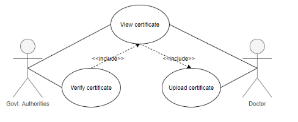

# Object Oriented Analysis & Design

## Introduction to OOAD and UML

### Q1. Which of the following statements about OOAD is correct?

1. Principles of OOAD are used once the software is developed.
2. Principles of OOAD are used before you start developing the software.
3. Principles of OOAD are used in the middle of software development.
4. Principles of OOAD are used once the software has been developed and launched in the market.

> ✓ Correct Answer-> **2**
>
> Feedback:
> _OOAD is used to define what functionalities the system needs to perform and how those functionalities will be implemented. As OOAD provides requirements and implementations for the system, it is the first step in any software development. This is the correct option._

### Q2. Which of the following statements is correct regarding attributes and methods?

1. Both attributes and methods define the properties of an object.
2. Attributes define the properties of an object, while methods define the actions of an object.
3. Both attributes and methods define the actions of an object.
4. Attributes define the actions of an object, while methods define the properties of an object.

> ✓ Correct Answer -> **2**
>
> Feedback :
> _Attributes define the properties of an object, while methods define the actions of an object. This option is correct._

### Q3. Which of the following statements is correct regarding UML (Unified Modeling Language)?

1. UML is a procedural programming language.
2. UML is an object-oriented programming language.
3. UML is not a programming language.
4. UML is a mix of procedural programming language and object-oriented programming language.

> ✓ Correct Answer -> **3**
>
> Feedback:
> _UML is used to design a system using visual representations and diagrams. It is not a programming language. This option is correct._

## Use Case Diagram

### Q1. Why will there be a communication gap between the Product Manager and the Developer if the software requirements are given in the form of textual information?

1. All the requirements cannot be captured in the textual form.
2. Plain text can be misinterpreted by some developers.

> ✕ Incorrect Answer -> **1**
>
> Feedback:
> _You can write elaborate textual documents to capture and explain all the requirements. So, this option is incorrect._

> ✓ Correct Answer -> **2**
>
> Feedback:
> _With plain text, you can write down all the requirements. But plain texts are open to interpretation, which can sometimes lead to misinterpretation. This is the reason why programming is not done in plain English text._

### Q2. Which of the following functionalities cannot be performed by the supplier? (Note: More than one option may be correct.)

1. Placing an order for other suppliers

2. Cancelling a placed order

3. Viewing an order

4. Updating an order

> ✓ Correct Answer -> **1**
>
> Feedback:
> _A supplier should not be able to place an order for other suppliers using the Inventory Management System. If the supplier himself is managing a separate inventory, then he will have a separate Inventory Management System for himself and he will be the Admin for that system. This is not the functionality performed by the supplier. Hence, this is one of the correct choices._

> ✓ Correct Answer -> **2**
>
> Feedback:
> _If a supplier does not have the requested products and has no time to manufacture the same, he will not accept the order. But he cannot cancel a placed order, as the same order can be supplied by some other supplier. This is not the functionality performed by the supplier; it should be performed by the Inventory Manager or Admin. Hence, this is one of the correct choices._

> ✓ Correct Answer -> **4**
>
> Feedback:
> _If a supplier does not have all the requested products and has no time to manufacture the same, he can refuse to supply the order. But he cannot update the placed order according to his convenience. This is not the functionality performed by the supplier; it should be performed by the Inventory Manager. Hence, this is one of the correct choices._

### Q3. Mark all the statements that are true in the context of use case diagrams. (Note: More than one option may be correct.)

1. Use case diagrams show what functionalities the system will perform.
2. Use case diagrams can only be drawn once you have the requirements in a textual form.
3. You don’t need any knowledge of programming to draw use case diagrams.

> ✓ Correct Answer -> **1**
>
> Feedback:
> _Use case diagrams are drawn during the findings of the analysis phase of OOAD and are used to capture the requirements for the system. So, they show what functionalities the system will perform. Hence, this is one of the correct options._

> ✕ Incorrect Answer -> **2**
>
> Feedback:
> _Use case diagrams can also be drawn without having the requirements in a textual form. In this approach, instead of writing requirements and actors in plain text, you just draw them. So, this option is incorrect._

> ✓ Correct Answer -> **3**
>
> Feedback:
> _Use case diagrams only represent what functionality the system will perform in simple English. So, you don’t need any programming knowledge. Hence, this is one of the correct options._

### Q4. In the UPSTAC application, the users can request a medical test. They then wait for the test request to be approved by the authorities. After approval and testing, they should be able to view the results in the app. Which of the following options correctly represents the use cases of the aforementioned system? [Note: Multiple options may be correct]

1. 
2. 
3. 
4. 

> ✓ Correct Answer -> **1**
>
> Feedback:
> _Use cases can be in any order and orientation. Here, you are capturing all the use cases from the requirement. So, this option is one of the correct choices._

> ✓ Correct Answer -> **2**
>
> Feedback:
> _Use cases can be in any order and orientation. Here, you are capturing all the use cases from the requirement. So, this option is one of the correct choices._

> ✓ Correct Answer -> **3**
>
> Feedback:
> _Use cases can be in any order and orientation. Here, you are capturing all the use cases from the requirement. So, this option is one of the correct choices._

> ✓ Correct Answer -> **4**
> Feedback:
> _Use cases can be in any order and orientation. Here, you are capturing all the use cases from the requirement. So, this option is one of the correct choices._

### Q5. In the UPSTAC application, users can request a test. The tester is supposed to collect the health parameters. The doctor looks at the collected health parameters, diagnoses the patient, and updates the test results. Which of the following options correctly represents all use cases and actors for the aforementioned system?

1. 
2. 
3. 
4. 

> ✓ Correct Answer -> **4**
>
> Feedback:
> _Here, you are capturing all the use cases and actors that were part of the requirements given in the problem description. Also, the use cases and actors are represented using correct figures. So, this option is the correct choice._

### Q6. In the UPSTAC application, the user requests for the test, and the tester collects the health parameters. Which of the following is the correct use case diagram for the given two actors and use cases? [Note: More than one option may be correct]

1. 
2. 
3. 
4. 

> ✓ Correct Answer -> **1**
>
> Feedback:
> _Both the actors and use cases are represented appropriately. The order or the position of the use cases and actors does not matter if they are connected correctly. So, this option is correct._

> ✓ Correct Answer -> **3**
>
> Feedback:
> _Both the actors and use cases are represented appropriately. The order or the position of the use cases and actors does not matter if they are connected correctly. So, this option is correct._

### Q7. In the UPSTAC application, a user requests for tests, and the tester collects the health parameters. These are then given to the doctor, who updates the test results, which can later be viewed by the user. Which of the following is the correct use case diagram for the aforementioned system?

1. 
2. 
3. 
4. 

> ✓ Correct Answer -> **4**
>
> Feedback:
> _All the use cases are correct functionalities and are appropriately matched with the respective actors. This option is correct._

### Q8. In UPSTAC, a test management system is created where the users can request for tests. On approval, they can get tested and subsequently view the results. Which of the following is the correct use case diagram for the aforementioned system?

1. 
2. 

> ✓ Correct Answer -> **2**
>
> Feedback:
> _Viewing and updating test results must be two separate tasks. This option is incorrect._

### Q9. In the UPSTAC application, one of the responsibilities of the concerned government authorities is to verify the roles of doctors and testers in the app. The doctors and testers are given corresponding certificates for their roles, which they must upload in order to get approved. Take a look at the following diagram depicting the aforementioned system and mark all the statements that are correct. [Note: More than one option may be correct.]

1. To approve user using the Verify certificate use case, the concerned government authorities have to first view the certificate using the View certificate use case.

2. To approve a user using the Verify certificate use case, the concerned government authorities can first view the certificate using the View certificate use case, but it is not mandatory.

3. To execute the View certificate use case, the Verify certificate use case needs to be executed first, but the reverse is not true.

4. To execute the Verify certificate use case, the View certificate use case needs to be executed first, but the reverse is not true.

> ✓ Correct Answer -> **1**
>
> Feedback:
> _The included use case has to be executed before the including use case can execute. In this case, Verify certificate is the including use case, whereas View certificate is the included use case. So, whenever the authorities verify a certificate using the Verify certificate use case, they have to first view the certificate using the View certificate use case. This option is one of the correct choices._

> ✓ Correct Answer -> **4**
>
> Feedback:
> _The included use case has to be executed before the including use case. In this case, Verify certificate is the including use case, whereas View Invoice is the included use case. So, to execute the Verify certificate use case, the View Invoice use case needs to be executed first, not the other way around. This is one of the correct choices._

### Q10. In UPSTAC, one of the responsibilities of the concerned government authorities is to verify the roles of doctors and testers in the app. The doctors and testers are given corresponding certificates for their roles, which they must upload in order to get approved. Take a look at the following diagrams about include relationships and mark all of the correct options.

1. 
2. 
3. 

> ✓ Correct Answer -> **2**
>
> Feedback:
> _In this option, there is no connection between the Upload certificate and the View certificate use cases, which is correct, as these two use cases are independent of each other. A doctor can view the certificate whenever needed, without having to upload the certificate every time. Also, a Verify certificate use case is dependent on the View certificate use case, which is also correctly represented here. This option is correct._

### Q11. Take a look at the following diagram and mark the correct statement.

1. Whenever the authorities want to view the statistics using the View statistics use case, they must first view the test results of patients in a locality using the View test results by pin-code use case.
2. Whenever the authorities want to view the statistics using the View statistics use case, they can first view the test results of patients in a locality using the View test results by pin-code use case. However, this is not mandatory.
3. To execute the View statistics use case, the View test results by pin-code use case needs to be executed first, but the reverse is not true.
4. To execute the View test results by pin-code use case, the View statistics use case needs to be executed first, but the reverse is not true.

> ✓ Correct Answer -> **2**
>
> Feedback:
> _The extended use case (to which the arrow points) can be executed with or without the execution of the extending use case (from which the arrow starts). In this case, View statistics is an extended use case, whereas View test results by pin-code use case is an extending use case. So, whenever the concerned government authorities want to view the statistics using the View Statistics use case, they have the option to first check the test results using the View test results by pin-code use case. However, viewing test results by PIN code is not mandatory. This option is correct._

### Q. Which of the following statements regarding include and extend relationships is correct?

1. In an include relationship, the arrow starts from the including use case and points towards the included use case, whereas in an extend relationship, the arrow starts from the extended use case and points towards the extending use case.

2. In an include relationship, the arrow starts from the included use case and points towards the including use case, whereas in an extend relationship, the arrow starts from the extending use case and points towards the extended use case.

3. In an include relationship, the arrow starts from the including use case and points towards the included use case. Similarly, in an extend relationship, the arrow starts from the extending use case and points towards the extended use case.

4. In an include relationship, the arrow starts from the included use case and points towards the including use case. Similarly, in an extend relationship, the arrow starts from the extended use case and points towards the extending use case.

> ✕ Incorrect Answer -> **1**
>
> Feedback:
> _In both include and extend relationships, the arrow starts from the ‘ing’ use case and points towards the ‘ed’ use case, i.e., from including to included and from extending to extended. This option is not the correct choice._

> ✓ Correct Answer -> **3**
>
> Feedback:
> _In both include and extend relationships, the arrow starts from the ‘ing’ use case and points towards the ‘ed’ use case, i.e., from including to included and from extending to extended. This option is the correct choice._
